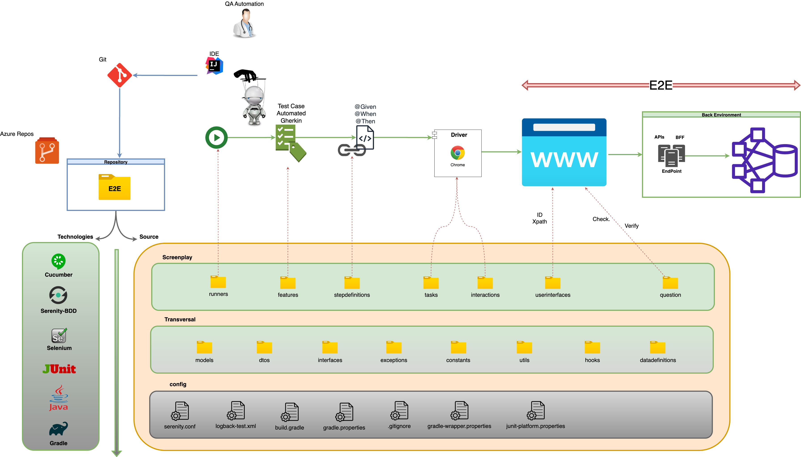
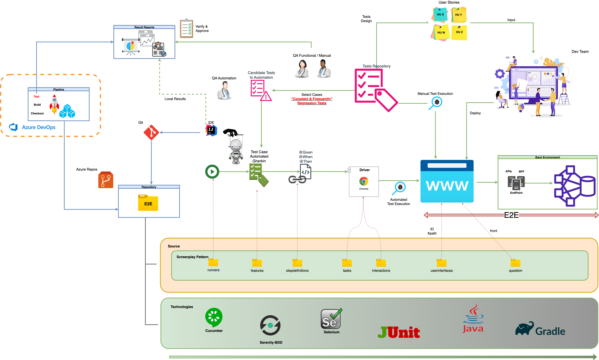
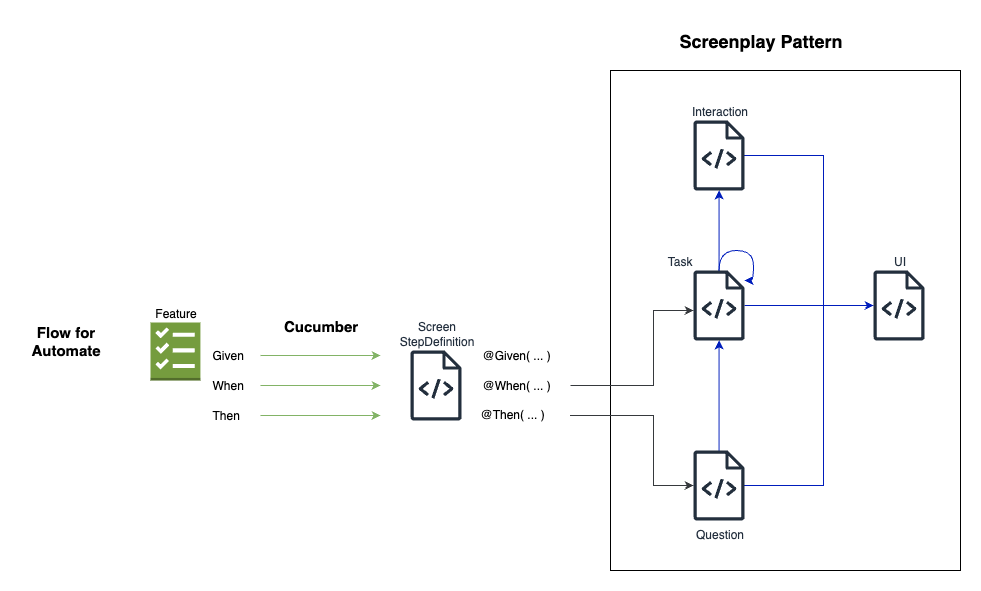
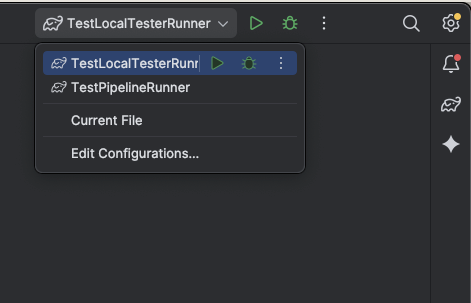
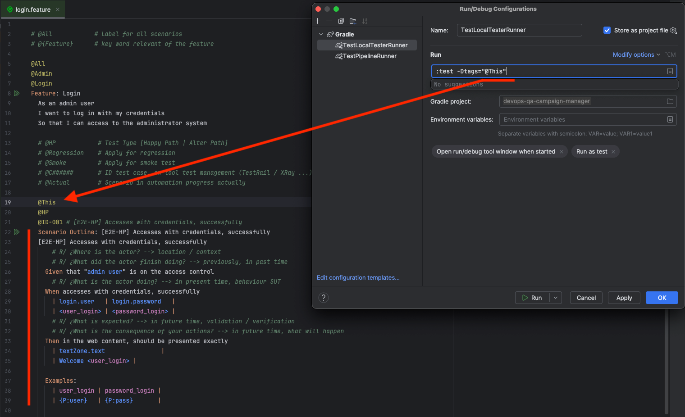
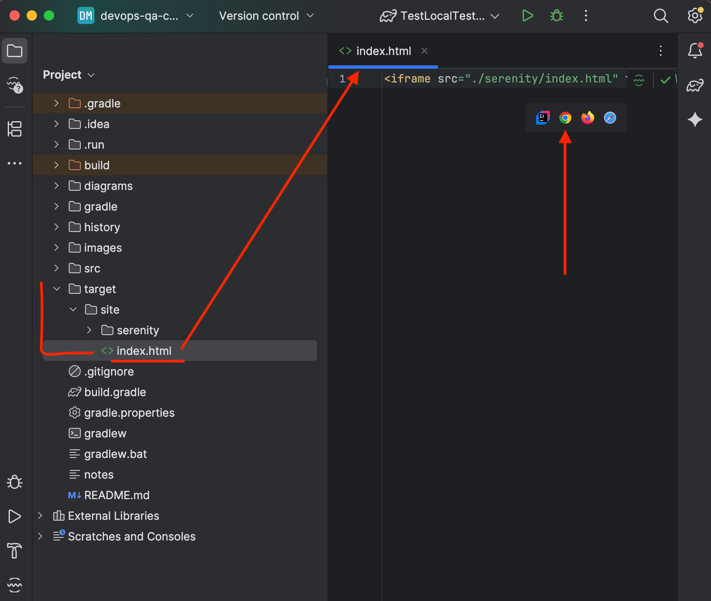
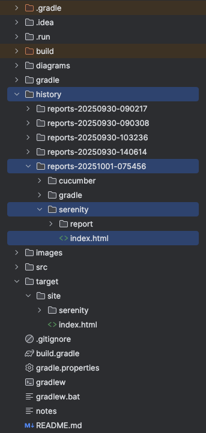

<h1 align="center">🦾 Web Test Automation - {{Project Name}} 🦾</h1>

<br>

This web automation project, developed in Java/Gradle with Serenity BDD, Selenium-WebDriver, Cucumber, and the 
Screenplay pattern, contains automated test scripts for various functionalities and workflows available in the 
{{Project Name}} application.

<br>

<div id='menu'></div>


## 📚 Table of contents:
1. [Architecture](#architecture)
    1. [General Architecture](#general_architecture)
    2. [Strategy Integration](#strategy_integration)
    3. [Project Structure](#project_structure)
    4. [Design Patterns](#design_patterns)
2. [Technologies / Tools](#technologies_tools)
3. [Prerequisites](#prerequisites)
4. [Setup](#setup)
5. [Run](#run)
6. [Report & Results](#report_results)
7. [Authors](#authors)


<br>


<div id='architecture'></div>

##  📐 Architecture [📚](#menu)

<br>

<div id='general_architecture'></div>

## General Architecture [📚](#menu)


[Generated in draw.io](https://app.diagrams.net/): ../diagrams/architecture.drawio

<br>

<div id='strategy_integration'></div>

## Strategy Integration [📚](#menu)


[Generated in draw.io](https://app.diagrams.net/): ../diagrams/architecture.drawio

<br>


<div id='project_structure'></div>


## 📂 Project Structure [📚](#menu)

### 📁 features: [./src/test/resources/.../]
>Scenarios and their test cases in Gherkin (Given-When-Then) language, with declarative narrative in business terms.
### 📁 runners: [./src/test/java/.../]
>Class that allows you to run tests (launcher)
### 📁 setups: [./src/test/java/.../]
>Setup and configuration classes that are triggered at the start, during, and end of a test case (ideal for Hooks)
### 📁 stepdefinitions: [./src/test/java/.../]
>Classes that technically translate the feature scenarios, orchestrating and delegating the necessary steps that satisfy the Gherkin statements, through tasks or questions.
### 📁 tasks: [./src/main/java/.../]
>Classes that describe the activities that the actor will perform on the system when interpreting a test case.
### 📁 interactions: [./src/main/java/.../]
>Classes that contain the low-level activities or set of actions that the actor requires to interact with the system.
### 📁 questions: [./src/main/java/.../]
>Classes that will evaluate the expected or expected behavior, following the activities of an actor in a test case, through validations and/or verifications
### 📁 userinterfaces: [./src/main/java/.../]
>Classes that represent the user view (screen/form), which contain the elements with which the actor will interact directly or indirectly during the test case.
### 📁 models: [./src/main/java/.../]
>Contains the representation of the identified business objects and their characteristics.
### 📁 utils: [./src/main/java/.../]
>Functions that are transversal and utilitarian to the business process or logic that is deployed in the execution/implementation of a test case.
### 📁 constants: [./src/main/java/.../]
>Contains a set of constants grouped and organized based on their behavior/purpose.

<br>

<div id='design_patterns'></div>

## Design Patterns [📚](#menu)


<br>[Generated in draw.io](https://app.diagrams.net/): ../diagrams/architecture.drawio

<br>

<div id='technologies_tools'></div>


## 🛠️ Technologies / Tools [📚](#menu)

| Purpose                         | Technology | Tool                    |
|---------------------------------|------------|-------------------------|
| BDD                             | Cucumber   | Gherkin                 |
| Framework Test Automation       | Screenplay | Serenity-BDD            |
| Technology Test Automation      | Selenium   | Selenium-WebDriver      |
| Test Asserts                    | JUnit      | JUnit                   |
| Programming Language            | Java       | JDK/JRE                 |
| Lifecycle, Build & Dependencies | Maven      | Gradle                  |
| Version Control                 | Git        | Azure Repos             |
| Quality Code                    | Sonar      | SonarLint, SonarCloud   |
| Code Editor                     | IDE        | IntelliJ IDEA           |
| Locators                        | DOM Page   | xpath, ID, CSS-Selector |


<br>

<div id='prerequisites'></div>

## 📋 Prerequisites [📚](#menu)

1. Java 17 (JDK).  https://www.oracle.com/java/technologies/javase/jdk17-archive-downloads.html
2. IDE IntelliJ IDEA - Community Edition.  https://www.jetbrains.com/idea/download/?
   * With plugins:
      * Cucumber for Java
      * Gherkin
      * HOCON
      * Lombok
      * SonarLint
3. Git (GUI/Bash)  https://git-scm.com/downloads
4. Chrome Browser.   https://www.google.com/chrome/dr/download/
5. Access to the test environment
   * {{ENTER HERE YOUR TEST ENVIRONMENTS, WHERE AUTOMATION WILL RUN}}

   
<br>

<div id='setup'></div>


## 📦 Setup [📚](#menu)
1. Clone/download project
   * HTTPS:
   ```
   git clone {{ENTER HERE YOUR HTTPS URL TO CLONE}}
   ```
2. Open project in your preferred IDE (IntelliJ recommended)
3. Managing dependencies with gradle
   - clean task
   - reload all gradle project
4. IDE Settings
   - Review JDK applied
   - Review plugins required

<br>

<div id='run'></div>


## 🚀 Run [📚](#menu)

To run/launch automated tests locally, the project has a preconfigured Gradle-based launcher (command). Here you can 
customize the tags corresponding to the tests described in the .features files.





<br>

<div id='report_results'></div>

## 🎯 **Report & Results** [📚](#menu)

After completing a test run, you can check the full report at:
>📁 target
>>📁 site
>>> 📊 index.html
>
<br>Opening the file from your preferred browser


<br>You can find a history of reports produced here, along with other reports generated by the system:
<br>



<br>

<div id='authors'></div>

##  ✍️️ Authors [📚](#menu)️
**QA Automation Engineer**
<br>**🕵️‍♂️ {{Tester Name}}**
<br>{{tester.name}}@arreglatech.com, {{tester.name}}@abogadaalexandra.com


<br>


<!--- comments section
Visor readme online
    https://stackedit.io/app#
urls emojis icons & symbols
    https://emojikeyboard.org/
    https://www.piliapp.com/emoji/list/?skin=1f3fc

      

